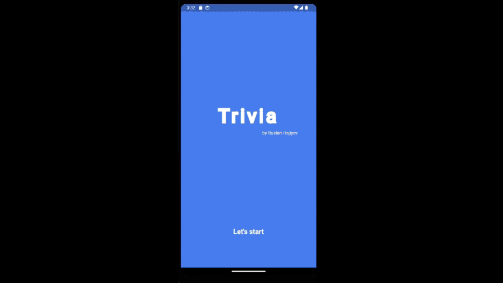
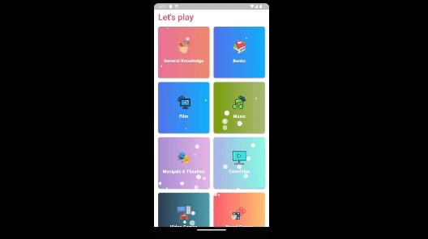

# Trivia Game

## Overview
Welcome to the **Trivia Game** Flutter app! This application is a fun and engaging trivia game designed to test your knowledge on various topics. It features smooth animations, vibrant theming, and an organized folder structure to ensure maintainability and scalability.

## Features
- **Animations:** The app uses the `simple_animations` library to create eye-catching animations that enhance the user experience.
- **Sound Effects:** With the help of the `audioplayers` library, the app incorporates various sound effects to make the gameplay more enjoyable.
- **State Management:** The app utilizes `flutter_bloc` with `Cubit` for managing the state, ensuring a predictable and testable app flow.
- **Secure Storage:** Sensitive data is stored securely using the `flutter_secure_storage` package.
- **RESTful API Integration:** The app communicates with the **Open Trivia Database** using `dio` for handling API requests and performing CRUD operations.
- **Theming:** Advanced theming has been implemented to ensure a consistent and aesthetically pleasing user interface.
- **Confetti Celebrations:** Celebrate your trivia wins with confetti animations using the `confetti` package.
- **Snackbar Notifications:** The app provides instant feedback using stylish snackbars with the `top_snackbar_flutter` package.

### Start Screen

### Quiz Screen

